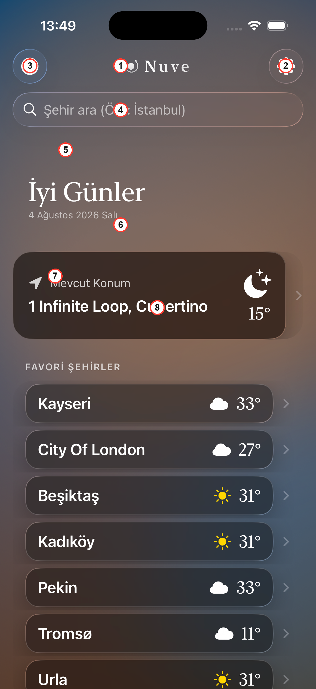
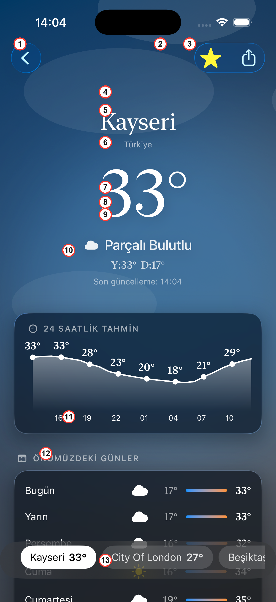

# Ekrana Yansıyan Kod — Hangi Satır Ekranda Neyi Üretiyor

`Satir-Satir-Kod-Aciklamasi.md` her satırın Swift SÖZ DİZİMİ kuralını (bu neden `guard`, bu neden
`@Published`, bu neden `enum`) anlatıyor. Bu dosya FARKLI bir soruya cevap veriyor: **aynı o
satırlar ÇALIŞTIĞINDA, gerçek cihazda/simülatörde ekranda TAM OLARAK ne beliriyor, hangi yazı,
hangi renk, hangi davranış hangi satırdan geliyor.**

Aşağıdaki iki ekran görüntüsü gerçek simülatörden alınmış GERÇEK ekran görüntüleridir (mockup/çizim
değil). Üzerlerindeki numaralı kırmızı işaretler, altlarındaki kod açıklamalarıyla birebir eşleşiyor.

---

## Bölüm 1 — Ana Ekran (`Views/HomeView.swift`)



### ① — Üstteki "Nuve" logosu

```swift
.toolbar {
    ToolbarItem(placement: .principal) {
        BrandHeader()
    }
    ...
}
```
`ToolbarItem(placement: .principal)`, verdiğin View'ı gezinme çubuğunun **tam ortasına** yerleştirir
— görseldeki ①, ekranın en üstünde, ortalanmış şekilde duran özel logo/"Nuve" yazısı. `BrandHeader()`
kendi başına ayrı bir dosyada (`DesignSystem/BrandHeader.swift`) tanımlı, küçük bir View; burada onu
sadece ÇAĞIRIYORUZ, çizimi orada.

### ② — Sağ üstteki dişli (Ayarlar) ikonu

```swift
ToolbarItem(placement: .navigationBarTrailing) {
    Button {
        showSettings = true
    } label: {
        Image(systemName: "gearshape.fill")
    }
}
...
.sheet(isPresented: $showSettings) {
    SettingsView()
}
```
`Image(systemName: "gearshape.fill")` görseldeki ② ikonunun KENDİSİ — Apple'ın SF Symbols
kütüphanesinden hazır bir ikon, biz sadece isim veriyoruz, çizimi sistem yapıyor. Dokununca
`showSettings = true` çalışır; bu satır, dosyanın en altındaki `.sheet(isPresented: $showSettings) { SettingsView() }`'ı
TETİKLER — yani bu tek satırlık atama, Ayarlar sayfasının aşağıdan yukarı kayarak AÇILMASININ
sebebidir.

### ③ — Sol üstteki huni (Filtre) ikonu

```swift
ToolbarItem(placement: .navigationBarLeading) {
    Button {
        showFilter = true
    } label: {
        Image(systemName: filter.isActive ? "line.3.horizontal.decrease.circle.fill" : "line.3.horizontal.decrease.circle")
    }
}
```
Buradaki `? :` (üçlü koşul operatörü) görselde tam olarak neyin göründüğünü belirliyor: kullanıcının
şu an aktif bir filtre kriteri VARSA ikon **dolu** (`.fill`), yoksa **boş** hâlde görünüyor —
görseldeki ③ şu an boş, yani `filter.isActive` şu an `false`. Bu ikon, ayarlar ikonuyla BİREBİR AYNI
mantıkla, dokununca `showFilter = true` olup `WeatherFilterView`'ı açıyor.

### ④ — Arama çubuğu

```swift
.searchable(
    text: $searchService.searchQuery,
    placement: .navigationBarDrawer(displayMode: .always),
    prompt: "Şehir ara (Örn: İstanbul)"
)
```
Bu **tek satır**, görseldeki ④'ün TAMAMINI (büyüteç ikonu, gri placeholder yazısı, dokununca açılan
klavye, yazarken beliren "İptal" butonu) üretiyor — biz kendi metin kutumuzu ÇİZMİYORUZ, SwiftUI'ın
hazır `.searchable` bileşenini kullanıyoruz. `prompt:` parametresindeki metin, birebir görseldeki gri
yazı ("Şehir ara (Örn: İstanbul)"). `text: $searchService.searchQuery` bağlantısı sayesinde,
kullanıcı her harf yazdığında `LocationSearchService` içindeki `searchQuery` değişkeni GÜNCELLENİYOR
— bu da o servisin `didSet` bloğunu tetikleyip arama isteğini başlatan zincirin İLK halkası.

### ⑤ — "İyi Günler" selamlaması ve tarih

```swift
VStack(alignment: .leading, spacing: 2) {
    Text(greeting)
        .font(.weatherCityName)
        .foregroundColor(.white)
    Text(Date.now.formatted(date: .complete, time: .omitted))
        .font(.weatherCaption)
        .foregroundColor(.white.opacity(0.6))
}
```
`Text(greeting)` — görseldeki "İyi Günler" yazısı. `greeting` bir computed property, saatin kaçta
olduğuna bakıp dört seçenekten birini döndürüyor:
```swift
switch hour {
case 5..<12: return "Günaydın"
case 12..<18: return "İyi Günler"
case 18..<22: return "İyi Akşamlar"
default: return "İyi Geceler"
}
```
Ekran görüntüsü saat 13:49'da alındığı için `12..<18` aralığına düşüp "İyi Günler" SEÇİLDİ — yani bu
metin sabit değil, HER açılışta o anki saate göre YENİDEN hesaplanıyor. Altındaki
`Date.now.formatted(date: .complete, time: .omitted)` ise "4 Ağustos 2026 Salı" yazısını, sistemin
kendi tarih biçimlendiricisiyle üretiyor (`.complete` = gün adı + tam tarih; `time: .omitted` = saat
GÖSTERME).

### ⑥ — Mevcut Konum kartı

```swift
if let locationName = locationManager.displayLocationName {
    Text(locationName)
        .font(.weatherRowTitle)
        .foregroundColor(.white)
} ...
...
if let weather = currentLocationWeather {
    Image(systemName: weather.systemIconName)
        .font(.system(size: 36))
        .symbolRenderingMode(.multicolor)
    Text(viewModel.preferredUnit.format(weather.temperature))
        .font(.weatherRowTemperature)
} ...
```
- `Text(locationName)` → görseldeki "1 Infinite Loop, Cupertino" yazısı; `LocationManager`'ın GPS
  koordinatını Apple'ın reverse-geocoding servisiyle okunabilir bir adrese çevirmiş hâli.
- `weather.systemIconName` → sağdaki ay+yıldız ikonunu üretiyor. Bu computed property `isNight`'a
  bakıyor (`gündoğumu`/`günbatımı` saatleriyle KIYASLANARAK hesaplanıyor); ekran görüntüsü saat
  13:49'da Türkiye'den alındı ama Cupertino'da o an GECE olduğu için `moon.stars.fill` seçildi —
  yani bu ikon şehrin KENDİ yerel saatine göre değişiyor, cihazın saatine göre DEĞİL.
- `viewModel.preferredUnit.format(weather.temperature)` → "15°" yazısı.
- Bu HStack'in tamamına uygulanan `.weatherGlassCard()` (kod içinde biraz daha aşağıda), kartın
  hafif bulanık/camsı görünümünü (yuvarlak köşe, ince kenarlık, yumuşak gölge) veren PAYLAŞILAN
  modifier — kartın koyu lacivert/kahverengi tonu aslında arkasındaki `AmbientBackgroundView`'ın
  (Home'un gece paleti) bu camın ARDINDAN hafifçe sızması.

### ⑦⑧ — "FAVORİ ŞEHİRLER" başlığı ve favori listesi

```swift
} header: {
    Text("FAVORİ ŞEHİRLER")
        .font(.weatherSectionHeader)
        .tracking(1.1)
        .foregroundColor(.white.opacity(0.75))
}
...
ForEach(viewModel.savedCities) { favorite in
    NavigationLink(destination: WeatherView(
        location: favorite.location,
        zoomNamespace: heroNamespace,
        zoomSourceID: favorite.name,
        favorites: viewModel.savedCities
    )) {
        FavoriteCityRow(
            city: favorite.name,
            snapshot: viewModel.favoriteSnapshots[favorite.name.lowercased()],
            unit: viewModel.preferredUnit
        )
    }
}
```
⑦: `Text("FAVORİ ŞEHİRLER")` — `.tracking(1.1)` harfler arasına HAFİF bir boşluk ekleyip başlığa
"etiket" hissi veriyor.

⑧: `ForEach(viewModel.savedCities)` dizideki **her** favori için BİR satır üretiyor — görseldeki
"Kayseri", "City Of London", "Beşiktaş", "Kadıköy"... satırlarının HEPSİ bu TEK kod bloğundan, her
seferinde farklı bir `favorite` değeriyle ÇOĞALTILARAK geliyor (kod bir kere yazıldı, ekranda yedi
kez tekrarlanıyor). `FavoriteCityRow`'a geçirilen `snapshot: viewModel.favoriteSnapshots[favorite.name.lowercased()]`
satırı ÖNEMLİ: bu sözlükte o şehrin kaydı VARSA (`FavoriteCityRow.swift`'teki `if let snapshot`
dalı), satırda direkt ikon+sıcaklık ("Kayseri 33°") gösteriliyor; YOKSA sadece isim + dönen bir
`ProgressView` gösteriliyor. Kullanıcı hiçbir şehre DOKUNMADAN, uygulama açılır açılmaz favori
satırlarında zaten sıcaklık görmesinin sebebi, `HomeView.onAppear`'daki `viewModel.refreshFavoriteSnapshots()`
çağrısının bu sözlüğü ÖNCEDEN doldurmuş olması.

---

## Bölüm 2 — Şehir Detay Ekranı (`Views/WeatherView.swift` + `Views/Components/WeatherContentView.swift`)



Bu görüntü, ana ekrandaki "Kayseri" favorisine dokununca açılan ekran.

### ① — Geri butonu

Bu ekranda ELLE yazılmış bir kod YOK — `NavigationLink` ile açılan her ekranda, `NavigationStack`
otomatik olarak bu chevron (`<`) butonunu ekliyor ve dokununca bir önceki ekrana dönüyor.

### ②③ — Yıldız ve paylaş butonları

```swift
ToolbarItem(placement: .navigationBarTrailing) {
    Button {
        withAnimation(.easeInOut(duration: 0.2)) {
            viewModel.toggleFavorite(name: favoriteKey, weather: currentWeather)
        }
    } label: {
        Image(systemName: viewModel.isFavorite(favoriteKey) ? "star.fill" : "star")
            .foregroundColor(.yellow)
            .font(.title2)
            .contentTransition(.symbolEffect(.replace))
    }
}
if let weather = currentWeather {
    ToolbarItem(placement: .navigationBarTrailing) {
        ShareLink(item: shareText(for: weather))
    }
}
```
②: `viewModel.isFavorite(favoriteKey) ? "star.fill" : "star"` — Kayseri ZATEN favori listesinde
olduğu için ekranda **dolu sarı yıldız** görünüyor. Dokununca `toggleFavorite` çağrılıp şehir
listeden ÇIKARILIR, `.contentTransition(.symbolEffect(.replace))` sayesinde ikon dolu halden boş
hale SERT bir kesme yerine yumuşak bir geçişle döner.

③: `ShareLink(item: shareText(for: weather))` — sağdaki kutu-ok ikonu; dokununca iOS'un kendi
paylaşım sayfası (Mesajlar, Mail, kopyala vb.) açılıyor. Paylaşılan METNİN kendisi
`shareText(for:)` fonksiyonundan geliyor: `"Kayseri: 33°, Parçalı bulutlu"` gibi bir cümle üretiyor.
`if let weather = currentWeather` şartı sayesinde bu buton veri GELMEDEN (yükleniyor durumundayken)
hiç GÖRÜNMÜYOR — paylaşılacak bir şey yokken buton da yok.

### ④⑤⑥ — Şehir ismi ve ülke

```swift
Text(weather.name)
    .font(.weatherCityName)
    .foregroundColor(.white)
    .padding(.top, 40)

Text(weather.localizedCountryName)
    .font(.weatherCaption)
    .foregroundColor(.white.opacity(0.6))
```
⑤: `Text(weather.name)` → büyük "Kayseri" yazısı. **Önemli**: bu isim OpenWeather'ın kendi ürettiği
isim DEĞİL — `WeatherLocation.applying(to:)` fonksiyonu tarafından kullanıcının aradığı/seçtiği
isimle DÜZELTİLMİŞ hâli (İstanbul yerine Karaköy çıkma hatasının çözümü — tam hikaye
`Satir-Satir-Kod-Aciklamasi.md`'de).

⑥: `weather.localizedCountryName` → "Türkiye" yazısı. `CityWeather` içindeki bu computed property,
API'nin verdiği ham "TR" ISO kodunu `Locale.current.localizedString(forRegionCode:)` ile okunabilir,
sistem diline göre değişen bir isme çeviriyor (İngilizce sistemde "Turkey" yazardı).

④: Bu ikisinin ÜSTÜNDEKİ boşluğun kaynağı `.padding(.top, 40)` satırının kendisi — şehir isminin
geri butonuna/yıldıza YAPIŞMASINI önlemek için bilerek bırakılmış bir nefes payı.

### ⑦⑧⑨ — Dev sıcaklık

```swift
Text(unit.format(weather.temperature))
    .font(.weatherHero)
    .foregroundColor(.white)
    .contentTransition(.numericText())
    .padding(.leading, 15)
```
Bu üçü BİRLİKTE tek bir `Text` satırını işaret ediyor. `unit.format(weather.temperature)` → "33°"
metnini üretiyor (kullanıcının santigrat/fahrenayt tercihine göre). `.font(.weatherHero)`,
`Typography.swift`'te tanımlı, 96 punto, İNCE ağırlıklı, SERİF bir font — uygulamanın "editöryel"
kimliğinin en belirgin göründüğü tek yer burası (geri kalan her şey yuvarlak/rounded tasarımda).
`.contentTransition(.numericText())` sayesinde, favoriler arası geçiş yapılıp sıcaklık değişince
rakamlar SERT bir değişim yerine birbirinin İÇİNDEN akarak DEĞİŞİYOR.

### Durum ikonu ve açıklaması (görselde ⑨'un hemen altı)

```swift
HStack(spacing: 8) {
    Image(systemName: weather.systemIconName)
        .symbolRenderingMode(.multicolor)
        .symbolEffect(.bounce, value: weather.conditionCode)
    Text(weather.conditionDescription.capitalized)
        .font(.weatherCondition)
}
.foregroundColor(.white)
.opacity(0.9)
```
`weather.systemIconName` → küçük bulut ikonunu üretiyor (Kayseri'nin `conditionCode`'u 801-804
aralığında olduğu için `cloud.fill` seçildi). `weather.conditionDescription.capitalized` → "Parçalı
Bulutlu" yazısı — servisin döndürdüğü açıklamanın İLK harfi büyütülmüş hâli.
`.symbolEffect(.bounce, value: weather.conditionCode)`: `conditionCode` her DEĞİŞTİĞİNDE (örn. alt
şeritten başka bir şehre geçilince), ikon hafifçe ZIPLIYOR — kullanıcının gözünün değişikliği fark
etmesini sağlayan küçük, bilinçli bir animasyon.

### Y:33° D:17° ve "Son güncelleme" satırları

```swift
HStack(spacing: 6) {
    Text(String(format: ..., unit.format(weather.tempMax)))
    Text(String(format: ..., unit.format(weather.tempMin)))
}
...
if let lastUpdated {
    Text("Son güncelleme: \(lastUpdated.formatted(date: .omitted, time: .shortened))")
}
```
"Y:33° D:17°" satırı günün ÖLÇÜLEN en yüksek/en düşük sıcaklığını gösteriyor — bu veri API'den
ZATEN geliyordu ama önceki bir sürümde hiç EKRANA basılmıyordu. "Son güncelleme: 14:04" ise
`lastUpdated` durumunun, veri her yenilendiğinde (`WeatherViewModel.fetchWeather` başarılı olduğunda
çalışan `lastUpdated = .now` satırı) otomatik güncellenen bir zaman damgası.

### ⑩⑪ — Saatlik tahmin grafiği

```swift
Chart {
    ForEach(Array(hourly.enumerated()), id: \.offset) { index, forecast in
        AreaMark(x: .value("Saat", forecast.time), y: .value("Sıcaklık", forecast.temperature))
            .foregroundStyle(LinearGradient(colors: [.white.opacity(0.4), .white.opacity(0.0)], startPoint: .top, endPoint: .bottom))
        LineMark(x: .value("Saat", forecast.time), y: .value("Sıcaklık", forecast.temperature))
            .foregroundStyle(.white)
            .lineStyle(StrokeStyle(lineWidth: 2, lineCap: .round, lineJoin: .round))
        if index % 3 == 0 {
            PointMark(x: ..., y: ...)
                .annotation(position: .top) {
                    Text(unit.format(forecast.temperature))
                }
        }
    }
}
.frame(height: 120)
```
Apple'ın `Charts` framework'ü kullanılıyor. `AreaMark` çizginin ALTINDAKİ hafif gradyanlı dolguyu
üretiyor (üstte belirgin, altta şeffaflaşan beyaz). `LineMark` beyaz eğrinin kendisi.
**`if index % 3 == 0`** satırı görseldeki en önemli detay: "sadece 3'e tam bölünen indekslerde bir
NOKTA ve sıcaklık ETİKETİ çiz" demek — bu satır OLMASA 24 saatin HEPSİNE bir etiket konur, üst üste
binip okunmaz olurdu; bu koşul sayesinde sadece 16, 19, 22, 01, 04, 07, 10 gibi 3 saatlik
aralıklarda (x eksenindeki işaretlerle BİREBİR aynı hizada) bir nokta+sayı görünüyor.

### ⑫ — "ÖNÜMÜZDEKİ GÜNLER" listesi

```swift
sectionHeader("ÖNÜMÜZDEKİ GÜNLER", icon: "calendar")
VStack(spacing: 12) {
    ForEach(daily) { day in
        DailyForecastRow(day: day, calendar: cityCalendar, unit: unit)
    }
}
.padding()
.weatherGlassCard()
```
`ForEach(daily)` her gün ("Bugün", "Yarın", "Perşembe"...) için bir `DailyForecastRow` satırı
üretiyor. `cityCalendar` parametresi ÖNEMLİ: "Bugün"/"Yarın" hesabının cihazın DEĞİL, o ŞEHRİN kendi
saat dilimine göre yapılmasını sağlıyor — aksi halde yurt dışı bir şehirde gün sınırı KAYAR, "Bugün"
yazan satır aslında dünün verisini gösterebilirdi.

### ⑬ — Alt favori değiştirme şeridi

```swift
.safeAreaInset(edge: .bottom) {
    if favorites.count > 1 {
        FavoriteSwitcherStrip(
            favorites: favorites,
            activeName: $activeName,
            snapshots: viewModel.favoriteSnapshots,
            unit: viewModel.preferredUnit
        )
    }
}
```
Görseldeki en altta duran "Kayseri 33°  ·  City Of London 27°  ·  Beşiktaş..." şeridini bu blok
üretiyor. `favorites.count > 1` şartı sayesinde tek favori varken şerit hiç GÖRÜNMÜYOR (tek şehir
arasında "geçiş" anlamsız olurdu). Aktif şehir (şu an gösterilen) BEYAZ dolgulu kapsülde, diğerleri
soluk kapsülde. Bir kapsüle DOKUNMAK `activeName`'i değiştirir, bu da `WeatherView`'daki
`.onChange(of: activeName)` bloğunu tetikleyip o şehrin verisini `viewModel.fetchWeather(for:)` ile
YENİDEN çeker — sayfa hiç DEĞİŞMEDEN, sadece içerik güncellenir. Bu, projenin ON BİR başarısız
denemeden sonra bulduğu, kaydırma/jest İÇERMEYEN gezinme çözümü (tüm hikaye `Kod-Rehberi.md`'de,
"Views/WeatherView.swift" bölümünde).

---

## Bölüm 3 — Ekran görüntüsü OLMAYAN diğer ekranlar

Bu üç ekran için otomatik gezinme bu tur teknik bir engelle karşılaştı (simülatörde dokunma
otomasyonu istikrarsız çalıştı), o yüzden GERÇEK bir ekran görüntüsü eklemedim — ama kod/etki
eşlemesi aynı detayda, aşağıda.

### Arama sonuçları listesi (`Views/HomeView.swift`)

```swift
} else if searchService.searchResults.isEmpty {
    Section {
        GlassWarningView(
            iconName: "magnifyingglass",
            message: String(format: String(localized: "search.no_results_format", ...), searchService.searchQuery)
        )
    }
} else {
    Section {
        ForEach(searchService.searchResults, id: \.self) { result in
            Button {
                Task { await selectSearchResult(result) }
            } label: {
                SearchResultRow(title: result.title)
            }
        }
    } header: {
        Text("ÖNERİLEN ŞEHİRLER")
    }
}
```
Arama kutusu BOŞ değilken bu blok devreye giriyor. `searchService.searchResults.isEmpty` DOĞRUYSA
(arama yapıldı ama sonuç yok), ekranda büyüteç ikonlu bir uyarı kartı ve `"\"xyz\" için sonuç
bulunamadı."` yazısı belirir — `%@` içeren format dizesi, aranan METNİ (`searchService.searchQuery`)
cümlenin İÇİNE otomatik YERLEŞTİRİR. Sonuç VARSA, `ForEach` her MapKit önerisi için bir satır
üretir; bir satıra dokununca `selectSearchResult(result)` çağrılır, bu da
`LocationSearchService.resolve(_:)` ile seçilen sonucu gerçek bir koordinata çözüp
`searchedLocation` durumunu doldurur — bu durum değişikliği, dosyanın altındaki
`.navigationDestination(item: $searchedLocation) { location in WeatherView(location: location, ...) }`
satırını TETİKLEYİP şehir detay ekranını açar.

### Ayarlar sayfası (`Views/SettingsView.swift`)

Ayarlar sayfası, `viewModel.preferredUnit` ve `viewModel.preferredWindUnit` değerlerini gösteren bir
seçim listesi. Kullanıcı "Fahrenayt"a dokununca `viewModel.preferredUnit = .fahrenheit` atanır — bu
`@Published` alan değiştiği İÇİN, ekranda o an açık olan HER View (Home'daki favori satırları, şehir
detay ekranındaki dev sıcaklık, hepsi) OTOMATİK olarak yeniden çizilip yeni birimde sıcaklık
gösterir; hiçbir yerde ağa yeniden istek ATILMAZ, çünkü `TemperatureUnit.format(_:)` dönüşümü
SADECE ekranda, zaten elde olan Celsius değeri üzerinde yapılır.

### Filtre sayfası (`Views/WeatherFilterView.swift`)

```swift
private var minBinding: Binding<Double> {
    Binding(
        get: { displayValue(filter.minTemperatureCelsius) },
        set: { filter.minTemperatureCelsius = min(celsiusValue($0), filter.maxTemperatureCelsius) }
    )
}
```
Kaydırıcılar (Slider) `filter` içinde HER ZAMAN Celsius saklıyor, ama kullanıcı Fahrenayt seçtiyse
kaydırıcının KENDİSİ de Fahrenayt DEĞERLERİYLE hareket etmeli. `minBinding`, bu ikisi ARASINDAKİ
dönüşümü ŞEFFAF şekilde yapan elle kurulmuş bir `Binding` — `get` OKURKEN Celsius'u görüntü birimine
çeviriyor, `set` YAZARKEN görüntü biriminden Celsius'a geri çeviriyor (ve `min(...)` ile alt sınırın
üst sınırı GEÇMESİNİ engelliyor). Kaydırıcının kendisi bu dönüşümden HİÇ HABERSİZ, sadece bir
`Binding<Double>` ile konuşuyor.

---

*Görsellerdeki ekran görüntüleri gerçek bir iOS 26 simülatöründen (iPhone 17) alınmıştır. Bu dosya,
kod değiştikçe elle güncellenmesi gereken bir referans — `Kod-Rehberi.md` ve
`Satir-Satir-Kod-Aciklamasi.md` ile birlikte okunmalı.*
